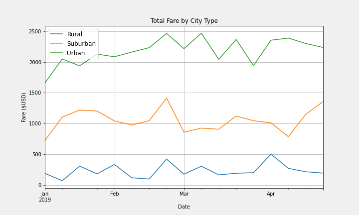

# PyBer_Analysis
 
## Overview
Analysis of ride-share business of Pyber utilizing data from January to early May 2019.  Pyber operates across the country in Urban, Suburban and Rural cities. Fare data is analyzed over the three city types as well as driver statistics to identify differences in the market types.

## Results

### Data distribution across city  type
Average fare, number of rides, and driver count by city type varies by city type:

### Summary Data by City Type

 * The vast majority of overall rides were in Urban and Suburban cities with 1,625 urban, 625 suburban and only 125 rides in rural cities
 * Likewise the number of drivers are much higher in urban and suburban cities compared to rural cities
 * Conversely the average fare per ride is much higher in rural cities ($34.62) vs suburban ($30.97) and urban ($24.53) cities
 * The average fare per driver shows even wider discrepencies between rural ($55.49), suburban ($39.50) and urban ($16.57)

The average fare per ride and driver discrepencies are most likely due to distance. Rural rides are most likely longer in distance and duration which would explain the higher fares. Conversely urban rides are most likely shorter rides with lower average fares. Additional data would be needed to confirm.

### Total Fare by City Type over time

## Summary
The above data analysis highlights discrepencies in the ride-share performances in the three city types - urban, suburban and rural.

### Business Recommendations
The following are recommendations to consider in addressing the business to address performance discrepencies.

 1.   Pull additional data in order to further analyze ride duration and driver downtime.
       * Ride duration
       * Driver shift durations
 2.   Consider reducing the number of drivers in the urban and suburban markets. Another discrepency across markets is the number of rides per driver:
       * Rural -    1.60 rides/driver
       * Suburban - 1.27 rides/driver
       * Urban -    0.67 rides/driver
     
The low average fare per driver in urban cities ($16.57) may be due to shorter rides but the low number of rides per driver indicates that urban drivers may have a large amount of downtime. This indicates that there are too many urban drivers for the current demand. Reducing the number of drivers should increase the number of rides per driver, increasing their earnings and increasing driver satisfaction.
     
 3.   Consider raising prices in the urban market. The high number of rides in the urban market stayed fairly consistent from January through early May. This may indicate high demand and opportunity to increase revenue and margins in the market without negatively impacting volume.

### Recommended further analysis
Market-share analysis is recommended in each of the markets to further understand the differences in the three city type markets and identify further opportunities for PyBer to expand and better business performance.
